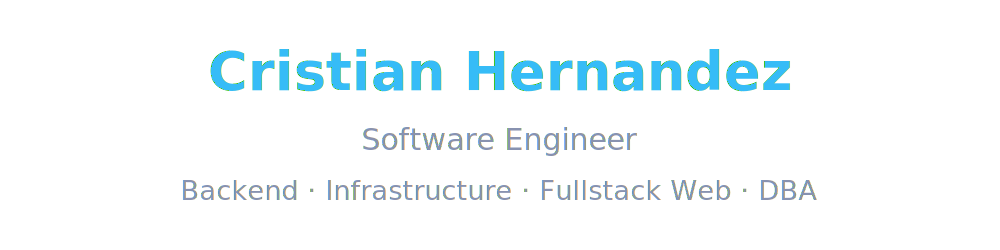

# 

## Tech Stack

 <!-- markdownlint-disable MD033 MD013 -->

  
  
  
  
  
  
  
  
  
  

## Currently Working On

**Backend for the USM academic services platform** using PostgreSQL/Supabase,
CI/CD, and managing infrastructure, replacing paper-based workflows for roughly
600 students and 30 staff members across two campuses.

## Featured Projects are Pinned Below

[Contact via email](mailto:cristianmedia9007@gmail.com) ·
[LinkedIn](https://www.linkedin.com/in/cristian-hern%C3%A1ndez-66b457304) ·
[GitHub](https://github.com/icristianhernandez)
